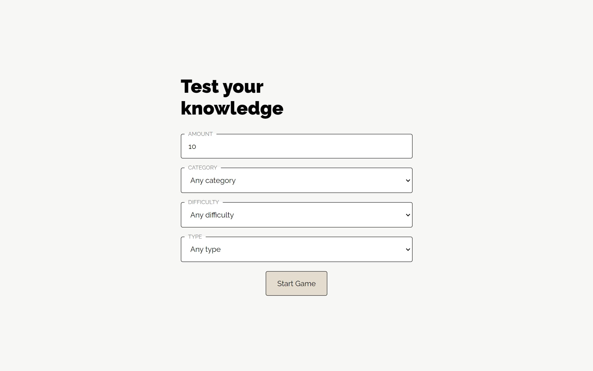

# Proyecto de Frontend utilizando Open Trivia Database API

Este proyecto utiliza la API de [Open Trivia Database](https://opentdb.com/) para mostrar preguntas de trivia. La API proporciona una amplia variedad de preguntas de trivia en diferentes categorías y niveles de dificultad, lo que permite a los usuarios disfrutar de un desafío divertido mientras ponen a prueba sus conocimientos.

## Funcionalidades

- **Cantidad de preguntas:** Puede elegir la cantidad de preguntas que quiera responder; solo se permiten valores del 1 al 15.
- **Selección de categorías:** Los usuarios pueden elegir entre una variedad de categorías de preguntas, incluyendo historia, ciencia, deportes, entretenimiento y más.
- **Niveles de dificultad:** Se ofrece la posibilidad de seleccionar el nivel de dificultad de las preguntas, desde fácil hasta difícil, según la preferencia del usuario.
- **Resultados:** Al finalizar el juego, se muestra un resumen de los resultados.
- **Interfaz intuitiva:** La interfaz de usuario está diseñada de forma sencilla y amigable, proporcionando una experiencia de usuario fluida y agradable.

## Tecnologías utilizadas

- **Astro/React:** El proyecto está desarrollado utilizando Astro con React y CSS Module para los estilos.
- **Fetch API:** Se utiliza Fetch API para realizar solicitudes HTTP a la API de Open Trivia Database y recuperar las preguntas de trivia.
- **React-Hook-Form y Zod:** El proyecto está utilizando React Hook Form para gestión del formulario y la biblioteca Zod para la validación de los datos.
